# 三幻美术资源提取指南

本文档详细介绍如何从三幻中提取美术资源，为后续的Spine动态立绘还原做准备。

## 📁 资源目录说明

### 目标目录位置
```
/data/data/com.aligames.star.sgzhxdl.aligames/files/miniRes
/data/data/com.aligames.star.sgzhxdl.aligames/files/udp
```

**⚠️ 重要说明：**
- `com.aligames.star.sgzhxdl.aligames` 为包名，请以实际安装的包名为准（此处以九游版本为例）
- 不同渠道的包名不同，请在设备中确认实际包名
- `miniRes`为安装包版本所包含的美术资源
- `udp`为增量更新的美术资源（新皮肤、武将等）

### 目录结构
美术资源目录（`miniRes、udp`）包含以下内容：

- ✅ **美术资源文件** - 本项目需要处理的Spine动画相关文件
- ❌ **cri_res目录** - 包含CG、主城动画壁纸等视频资源（.usm）和音频文件（.acb、.awb）
  - 本项目**不支持**处理此类资源
  - 如需提取此类资源，请使用其他专门工具

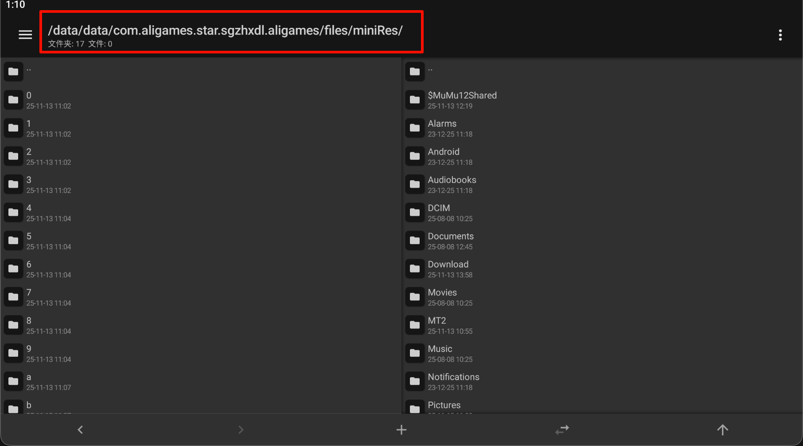

## 🔧 提取方法（安卓版本）

### 方案选择
- **推荐方案**：使用MuMu模拟器（无需root手机）
- **直接方案**：已root的安卓手机用户

### 第一步：环境准备

#### 1.1 安装MuMu模拟器
手机已root用户可跳过此步骤。

- 下载并安装 [MuMu模拟器](https://mumu.163.com/)
- 启动模拟器并创建新的手机/平板设备
- 在设备设置中**开启root权限**
- 在模拟器中安装三幻游戏
- **重要**：首次安装后需要打开游戏，等待完整资源下载完成

#### 1.2 安装MT管理器
在模拟器或手机中安装 [MT管理器](https://mt2.cn/)

### 第二步：提取资源文件

#### 2.1 授权并定位资源目录
1. 打开MT管理器并授予root权限（如已授权请忽略）
2. 导航至目录：`/data/data/{实际包名}/files/`

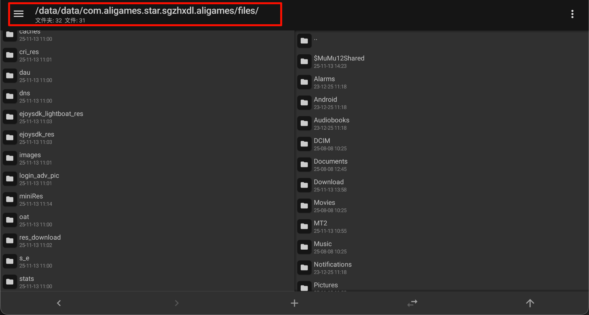

#### 2.2 压缩miniRes目录
1. 长按 `miniRes` 文件夹
2. 选择"压缩"操作
3. 压缩级别选择"仅存储"（压缩速度最快）
   - 选择原因：美术资源包含大量碎片化文件，压缩便于文件传输

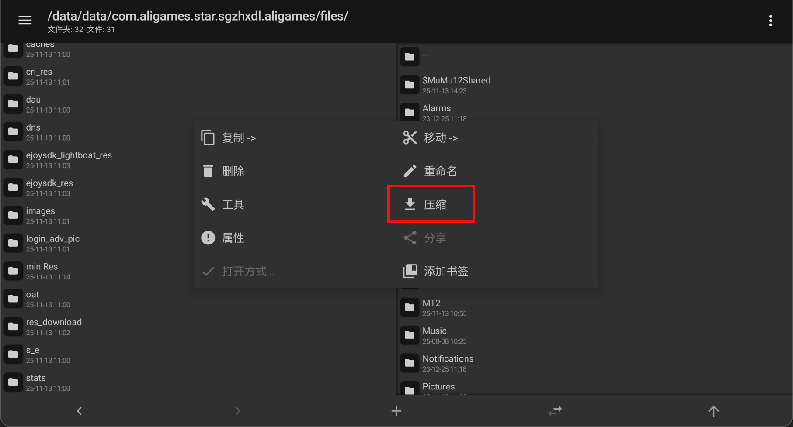
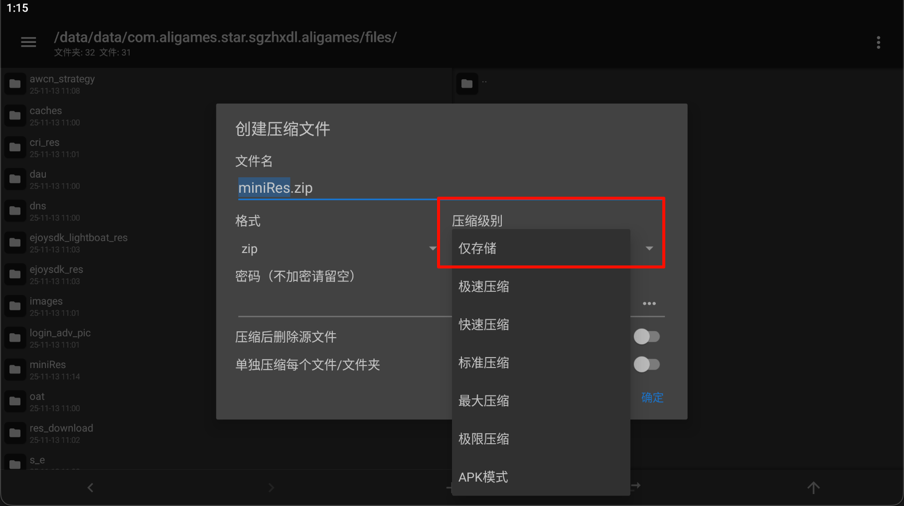

### 第三步：文件传输

#### 3.1 移动到共享目录
- **模拟器用户**：移动到 `/storage/emulated/0/$MuMu12Shared` 目录
- **手机用户**：移动到 `/storage/emulated/0/` 任意位置

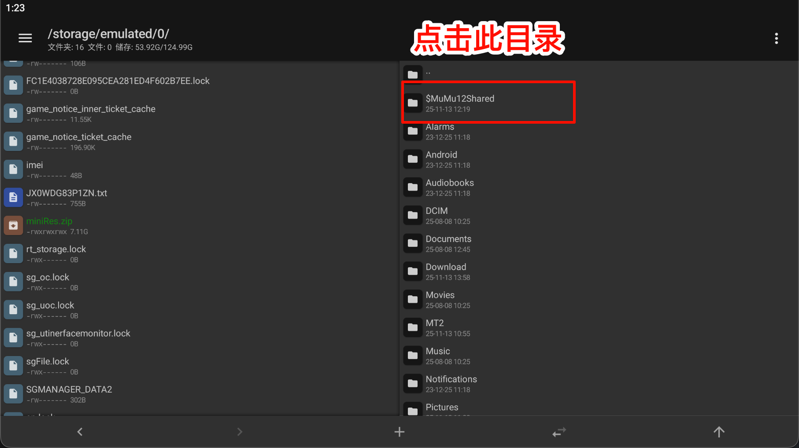
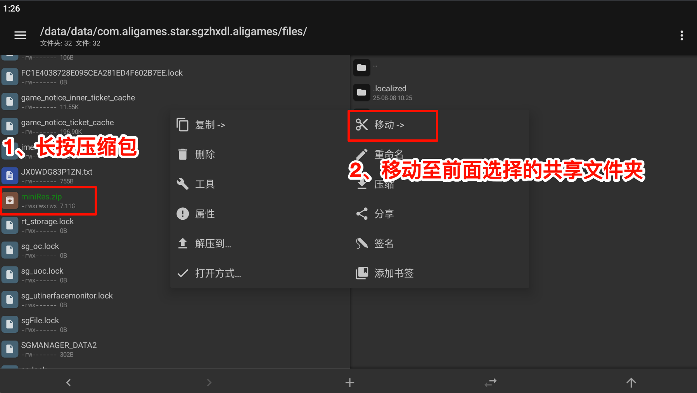

#### 3.2 传输到电脑

**Windows模拟器用户：**
- 参考 [MuMu官方教程](https://mumu.163.com/help/20230711/35047_1098046.html)

**macOS模拟器用户：**
- 共享文件夹位置：`'/Users/{用户名}/Library/Application Support/com.netease.mumu.nemux/MuMuPlayerProShared.localized'`
- 将 `{用户名}` 替换为您的实际用户名
- 打开访达，使用快捷键 `Command + Shift + G` 打开前往文件夹窗口
<!-- - 如果你的共享文件夹不是此目录（一般不会），可使用 App Cleaner & Uninstaller 等工具快速定位MuMu共享文件夹 -->

<!-- 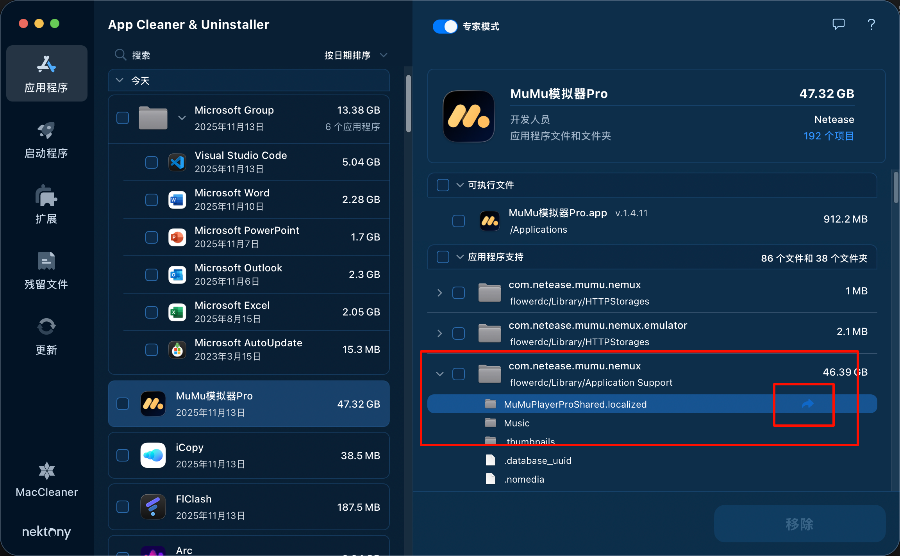 -->
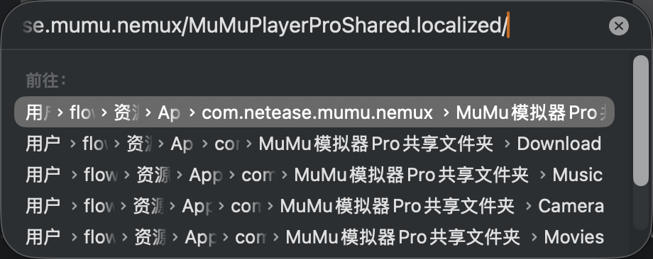
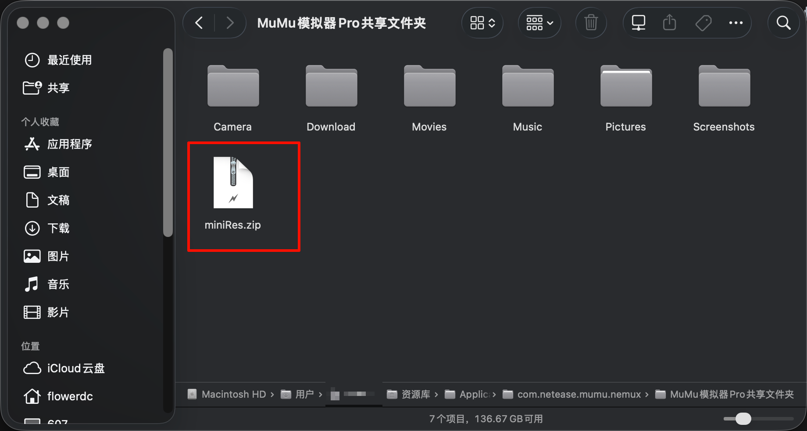

**手机用户：**
- 通过USB数据线、云存储或其他方式将 `miniRes.zip` 传输到电脑

### 第四步：文件处理

#### 4.1 解压文件
1. 将 `miniRes.zip` 移动到本项目目录下
2. 解压文件，得到 `miniRes` 目录

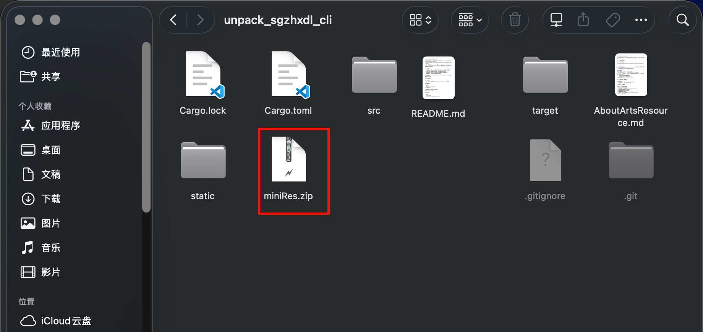


#### 4.2 清理不必要文件
**重要**：删除 `miniRes` 目录下的 `cri_res` 文件夹
- 减少后续处理的开销
- 本项目专注于Spine动画资源处理

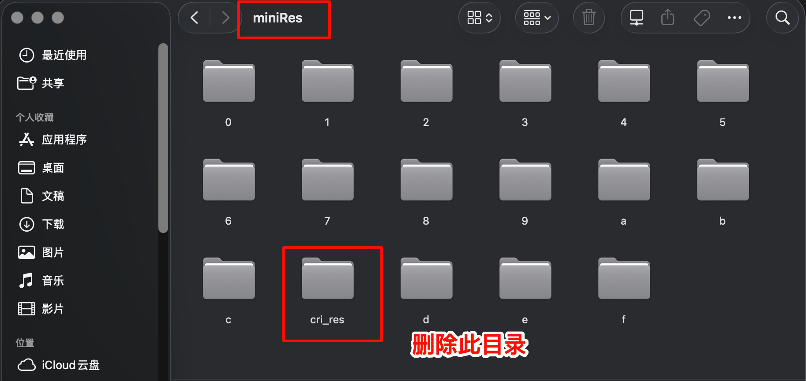

以上例举提取miniRes目录过程，提取udp过程相同，请自行操作。

## 🔗 后续步骤

完成美术资源提取后，请继续阅读 [README.md](./README.md)了解如何使用本工具进行Spine动态立绘还原。